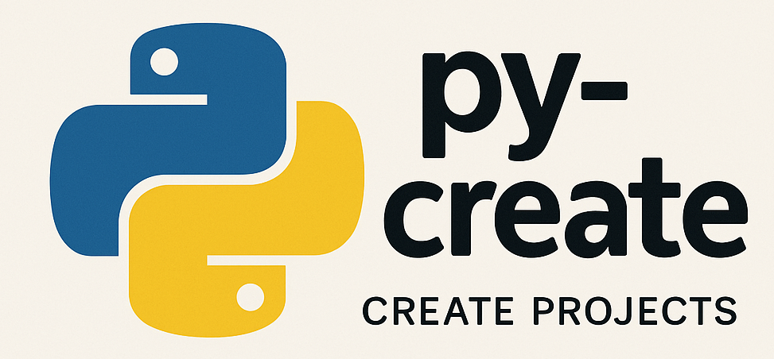

# py-create

## About

`py-create` is a repository for creating Python projects and install dependencies in a clic

## Features

- Script to set up a new Python project.
- Configuration files for linters and formatters.
- Example project structure.

## Requirements

- Python 3.x
- Shell

# Installation 
```
git clone https://github.com/Super-Code774/py-create/
cd py-create
```

## Usage

To create a new Python project, run the following command:
`sh py-create.sh`
